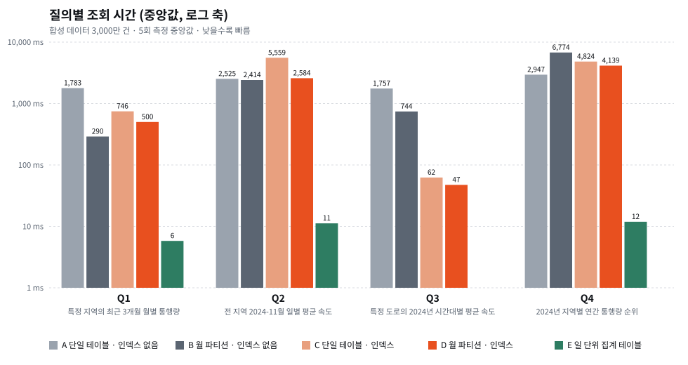
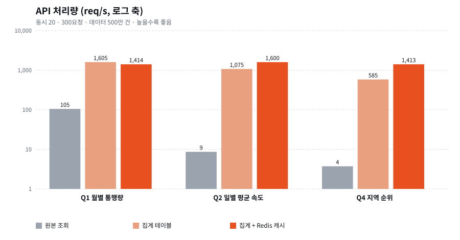

# traffic-stats-lab

교통 관측 통계 조회를 **월 파티셔닝 / 인덱스 / 집계 테이블**로 최적화했을 때 조회 시간이 어떻게 달라지는지 재현하고(1단계),
그 위에 **API · Redis 캐시 · 테스트 · 모니터링**을 얹어 운영 요소까지 직접 구성해 측정한 개인 프로젝트입니다(2단계).

> **이 저장소는 실제 프로젝트의 데이터·코드·수치를 사용하지 않았습니다.**
> 업무에서 다룬 "대용량 교통 데이터 통계 화면 응답속도 개선"의 **기법만** 공개 가능한 가짜 데이터로 다시 구현했습니다.
> 업무의 40TB, 수십 초 → 10초 이내라는 수치와 이 저장소의 결과(약 1.7GB)는 규모가 완전히 다르므로 직접 비교하면 안 됩니다.

## 1단계: DB 조회 시간 (합성 3,000만 건, 중앙값 5회)



| 질의 | A 단일·인덱스 없음 | B 월 파티션 | C 단일+인덱스 | D 월 파티션+인덱스 | E 집계 테이블 |
|---|---|---|---|---|---|
| Q1 특정 지역 3개월 월별 통행량 | 1,783ms | 290ms (6.1배) | 746ms (2.4배) | 500ms (3.6배) | **5.8ms (307배)** |
| Q2 전 지역 1개월 일별 평균 속도 | 2,525ms | 2,414ms (1.0배) | 5,559ms (**0.5배**) | 2,584ms (1.0배) | **11ms (225배)** |
| Q3 특정 도로 1년 시간대별 속도 | 1,757ms | 744ms (2.4배) | 62ms (28배) | **47ms (37배)** | - |
| Q4 지역별 연간 통행량 순위 | 2,947ms | 6,774ms (**0.4배**) | 4,825ms (**0.6배**) | 4,139ms (**0.7배**) | **12ms (248배)** |

(배수는 A 대비. 괄호 속 **굵은 숫자는 오히려 느려진 경우**입니다. 전체 표는 [`results/results.md`](results/results.md), 실행 계획은 `results/plans/`)

### 읽을 수 있는 것

1. **기법마다 잘 맞는 질의가 다릅니다.** 파티셔닝은 기간이 좁은 Q1에서, 인덱스는 조건이 좁은 Q3에서, 집계 테이블은 반복 집계(Q1·Q2·Q4)에서 효과가 컸습니다.
2. **인덱스와 파티셔닝은 항상 이득이 아닙니다.** 넓은 범위를 읽는 Q2·Q4에서는 단일 테이블 대비 느려지는 경우가 있었습니다.
3. **집계 테이블이 압도적이지만 대가가 있습니다.** 데이터 지연, 질의 유연성 상실, 정합성 관리가 필요합니다. 자세한 내용은 [`docs/decisions.md`](docs/decisions.md).
4. 모든 변형이 같은 답을 내는지 먼저 확인했습니다([`results/verification.md`](results/verification.md)).

### 읽을 수 없는 것 / 한계

- **Q4가 파티션 12개를 읽을 때 단일 테이블보다 느린 이유는 확인하지 못했습니다.** 추측은 하지 않았습니다. 실행 계획(`results/plans/B_Q4.txt`)으로 추가 조사가 필요합니다.
- **데이터는 균등 분포 합성 데이터**라서 실제 데이터의 쏠림(출퇴근 시간, 특정 지역 편중)이 없습니다.
- **모든 데이터가 메모리에 올라가는 규모(약 1.7GB, 인덱스 포함 약 3.5GB)**여서 실제 대용량 환경의 디스크 I/O 효과는 재현하지 못했습니다.
  Q2처럼 시간이 `to_char`와 정렬 같은 행별 계산에 쓰이는 질의는 스캔 범위를 줄여도 시간이 거의 줄지 않았습니다.
- 쓰기 성능, 동시 요청, 집계 테이블의 증분 갱신은 측정·구현하지 않았습니다.
- 측정은 1대의 노트북(아래 환경)에서만 수행했고, 결과는 환경에 따라 달라집니다.

## 2단계: API · 캐시 · 테스트 · 모니터링

`api/` 에 Spring Boot 3.5(Java 21) 조회 API 를 만들었습니다. 같은 통계를 **원본 / 집계 테이블 / 집계 + Redis 캐시** 세 방식으로 조회할 수 있고(`source`, `cache` 파라미터),
구성도는 [`docs/architecture.md`](docs/architecture.md) 에 있습니다.

### 부하 테스트 결과 (ApacheBench, 동시 20, 300요청, 데이터 500만 건)



| 질의 | 조회 방식 | 처리량 (req/s) | p50 | p95 | p99 | 실패 |
|---|---|---|---|---|---|---|
| Q1 월별 통행량 | 원본 조회 | 105 | 181 ms | 232 ms | 287 ms | 0 |
| Q1 월별 통행량 | 집계 테이블 | 1,605 (15배) | 9 ms | 46 ms | 71 ms | 0 |
| Q1 월별 통행량 | 집계 + Redis 캐시 | 1,414 (13배) | 12 ms | 27 ms | 35 ms | 0 |
| Q2 일별 평균 속도 | 원본 조회 | 9 | 2,313 ms | 2,626 ms | 2,675 ms | 0 |
| Q2 일별 평균 속도 | 집계 테이블 | 1,075 (124배) | 13 ms | 35 ms | 139 ms | 0 |
| Q2 일별 평균 속도 | 집계 + Redis 캐시 | 1,600 (185배) | 11 ms | 20 ms | 30 ms | 0 |
| Q4 지역 순위 | 원본 조회 | 4 | 5,527 ms | 6,576 ms | 7,501 ms | 0 |
| Q4 지역 순위 | 집계 테이블 | 585 (156배) | 24 ms | 71 ms | 100 ms | 0 |
| Q4 지역 순위 | 집계 + Redis 캐시 | 1,413 (378배) | 10 ms | 52 ms | 59 ms | 0 |

- 원본 조회는 질의에 따라 4~105 req/s, 집계 테이블은 585~1,605 req/s였습니다(15~156배).
- **캐시의 이득은 질의마다 달랐습니다.** Q4 는 585 → 1,413 req/s 로 늘었지만 Q1 은 1,605 → 1,414 req/s 로 차이가 없었습니다(이미 빠른 질의에는 캐시가 이득이 아님).
- 부하 생성기와 서버가 같은 노트북에서 돌아 절대값보다 상대 비교로 읽어야 합니다(`docs/decisions.md` 7번).

### Redis 장애 시 동작 (발견 → 수정 → 재측정)

| | 처리량 | p50 | p99 | 실패 |
|---|---|---|---|---|
| 정상 (캐시 사용) | 1,600 req/s | 11 ms | 30 ms | 0 |
| Redis 중단, **폴백만** | 17.9 req/s | 1,018 ms | 1,030 ms | 0 |
| Redis 중단, **서킷 브레이커 적용 후** | 674 req/s | 20 ms | 117 ms | 0 |

처음 구현한 "캐시 오류 시 DB로 대체"는 실패는 막았지만, 요청마다 타임아웃을 기다려 **요청당 약 1초**가 걸렸습니다.
오류 시 10초간 캐시를 건너뛰는 브레이커로 고쳤고, Redis 가 돌아오면 자동으로 다시 캐시를 씁니다([`docs/decisions.md`](docs/decisions.md) 6번).

### 테스트: 17개 (모두 통과)

| 종류 | 개수 | 내용 |
|---|---|---|
| 단위·슬라이스 | 14 | 캐시 적중/미스/키 분리, 입력 검증(400), Redis 장애 폴백, 서킷 브레이커 시간 동작 |
| 통합 (`LAB_IT=1`) | 3 | **실제 PostgreSQL 에서 원본과 집계 테이블이 같은 답을 내는지** |

```bash
cd api && ./gradlew test               # DB 없이 14개
LAB_IT=1 ./gradlew test                # 데이터셋 준비 후 17개 (scripts/api_dataset.sh)
```

### 모니터링

`docker compose` 로 Prometheus 와 Grafana 를 함께 띄우면, 프로비저닝된 대시보드(`ops/grafana/dashboards/traffic-api.json`)에
처리량, p95·p99 지연, DB 커넥션 풀, 5xx 비율, JVM 힙 6개 패널이 나옵니다.
Docker 환경(100만 건)에서 API → Prometheus 수집 → Grafana 쿼리까지 **6개 패널 모두 데이터가 반환되는 것**을 확인했습니다. (화면 캡처는 포함하지 않았습니다.)

### 실행 방법

```bash
# A. Docker (API, PostgreSQL, Redis, Prometheus, Grafana 한 번에)
docker compose up -d --build
LAB_ROWS=5000000 docker compose run --rm seed     # 합성 데이터 적재(처음 한 번)
#   API http://localhost:8081  /  Prometheus http://localhost:9090  /  Grafana http://localhost:3000

# B. 로컬 (Homebrew PostgreSQL + redis-server + Gradle)
./scripts/api_dataset.sh                           # 데이터 500만 건, 월 파티션 + 집계 테이블
redis-server --port 56379 --daemonize yes --save ""
cd api && ./gradlew bootJar && java -jar build/libs/traffic-stats-api-0.1.0.jar
python3 bench/load.py --n 300 --c 20               # 부하 테스트
```

### 만들면서 발견해서 고친 문제

1. **파티션 경계가 세션 시간대에 의존**: Docker(UTC)에서 데이터 적재가 실패했습니다. 경계를 한국 시간 자정으로 고정했습니다(`sql/20_partitioned.sql`). 1단계 결과는 영향이 없습니다(같은 경계).
2. **Redis 장애 시 요청당 1초 지연**: 위 서킷 브레이커로 해결.
3. **로컬 PostgreSQL WAL 이 7.9GB 로 증가**해 디스크가 부족해졌고, `max_wal_size` 를 낮췄습니다(`scripts/pg.sh`).

## 환경

| 항목 | 값 |
|---|---|
| 장비 | MacBook, Intel Core i5-8257U (논리 8코어), RAM 8GB, macOS 15.8 |
| DB | PostgreSQL 18.3 (Homebrew, 프로젝트 폴더 안 격리 클러스터) |
| 주요 설정 | shared_buffers 1GB, work_mem 64MB, jit off, 병렬 워커 2 (`scripts/pg.sh`) |
| 데이터 | 합성 3,000만 건, 2023-01 ~ 2024-12, 지역 31개, 도로 2,000개 |
| 크기 | 테이블 1.7GB, 인덱스 1.8GB(2개), 집계 테이블 2.2MB(22,661행) |

## 재현 방법

```bash
# 디스크 약 10GB 여유와 PostgreSQL 설치(Homebrew) 필요. 약 15분.
./scripts/run_all.sh                    # 기본 3,000만 건
ROWS=5000000 ./scripts/run_all.sh       # 줄여서 빠르게
```

## 구성

```
sql/        스키마·데이터 생성·인덱스·집계 테이블
bench/      측정(run.py)·검증(verify.py)·차트(chart.py)
scripts/    pg.sh(격리 PostgreSQL), run_all.sh(전체 재현)
results/    timings.csv, results.md, chart.svg, plans/, answers/, verification.md
docs/       decisions.md (선택과 포기)
```

## 한계 및 하지 않은 것

- GitHub Actions(`.github/workflows/ci.yml`)는 push 후 실제로 실행되어 단위 테스트, 소규모 데이터 적재, 통합 테스트(원본·집계 결과 일치)가 모두 통과했습니다.
- 부하 테스트는 로컬 구성(JAR 직접 실행)에서만 했고, Docker 환경은 동작 확인 수준(100만 건)입니다.
- k6 가 아니라 `ab` 를 썼습니다(시나리오·점진 부하 없음).
- **캐시 무효화, 집계 테이블의 증분 갱신, 인증, 쓰기 경로는 구현하지 않았습니다.**
- 합성 균등 분포 데이터라서 실제 데이터의 쏠림과 규모(업무 데이터는 이보다 훨씬 큼)를 반영하지 못합니다.
- Q4 가 파티션 12개를 읽을 때 단일 테이블보다 느린 이유는 확인하지 못했습니다.
